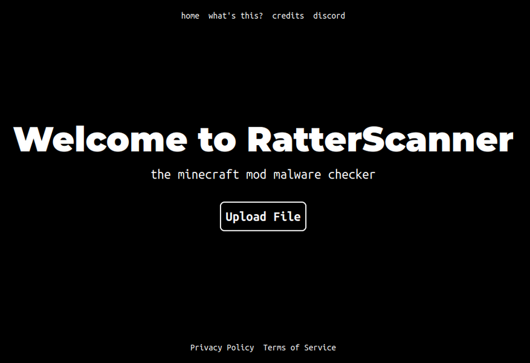

# RatterScanner Site

A website made for RatterScanner that let the users see more details about a scan, from a file or a scan ID.

This rewrite is currently not hosted.

## Screenshots

## Running (dev server)

- `npm i`
- `npx vite dev`

## Contributing
You are able to selfhost parts of the website. 
File submission will not work on a self-hosted instance without an API key. 
A testing process for submission may be available in future.
Feel free to suggest new features or improvements via Github issues! Please assign issues that require modifications to the backend to @eGirlQuint
